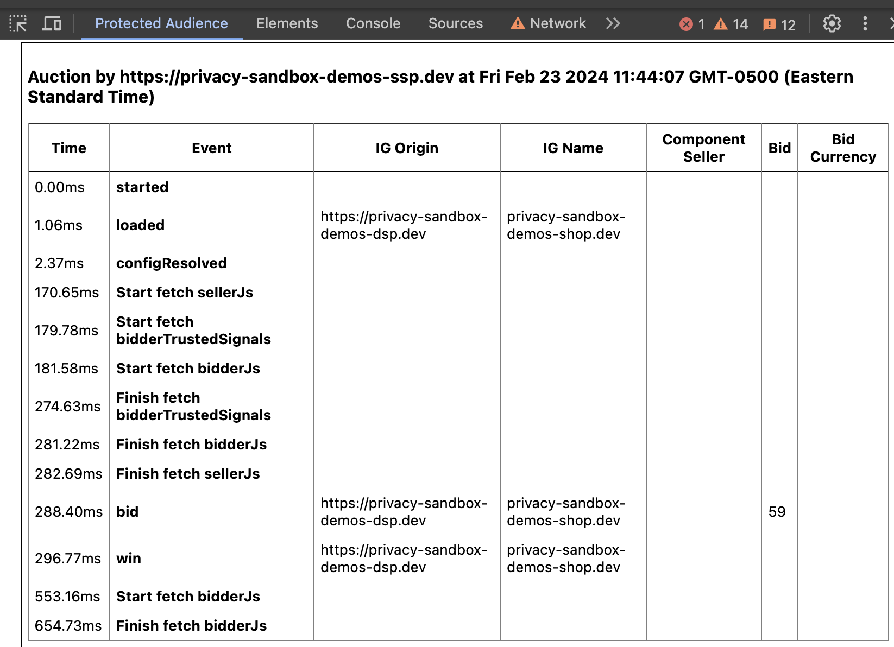

# Protected Audience DevTools extension code sample

## Description

This sample code shows how a Chrome DevTools extension for Protected Audience could be created. The sample code collects the events and organizes them in separate tables for different auctions.

This is not an officially supported Google product.

See the following files:

- [All code samples](https://github.com/GoogleChromeLabs/trust-safety-demo/tree/main/protected-audience/samples/devtools-extension/src)
- [`devtools.js`](https://github.com/GoogleChromeLabs/trust-safety-demo/tree/main/protected-audience/samples/devtools-extension/src/devtools.js)
- [`service-worker.js`](https://github.com/GoogleChromeLabs/trust-safety-demo/tree/main/protected-audience/samples/devtools-extension/src/service-worker.js)

## Instructions

Download the files in the code sample's `/src` folder and [load the unpacked files](https://developer.chrome.com/docs/extensions/get-started/tutorial/hello-world#load-unpacked)